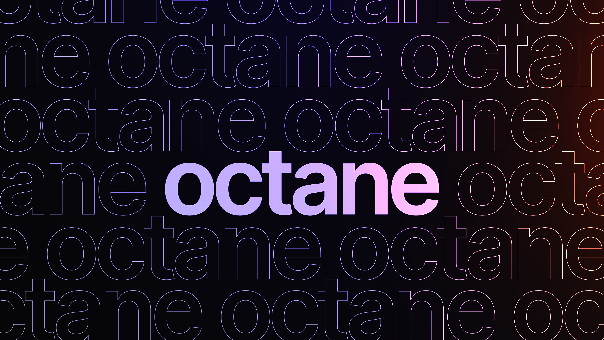

  

  <a href="https://octane.team/">Website</a> &nbsp;&middot;&nbsp;
  <a href="mailto:hello@octane.team">Email</a> &nbsp;&middot;&nbsp;
  <a href="https://www.linkedin.com/company/teamoctane/">LinkedIn</a> &nbsp;&middot;&nbsp;
  <a href="https://x.com/builtbyoctane">X</a> &nbsp;&middot;&nbsp;
  <a href="https://instagram.com/builtbyoctane">Instagram</a>

---

We're an independent studio building products across food, money, productivity, and policy. Some commercial, some open — all made carefully, by a small team, on no one's timeline but our own.

No big promises. Just quietly useful software that works.

---

### Our Products

<table>
  <tr>
    <td width="50%" align="center">
      <a href="https://allocat.octane.team/">
        <strong>Allocat</strong>
      </a>
        
      Envelope-style budgeting that makes the math of your month feel obvious.
        
      
      
    </td>
    <td width="50%" align="center">
      <a href="https://glyphs.octane.team/">
        <strong>Glyphs</strong>
      </a>
        
      A clipboard manager that remembers everything you copy.
        
      
      
    </td>
  </tr>
</table>

---

### Open Source

We open-source the products where trust matters more than the moat.

---

  <a href="https://octane.team/"><strong>octane.team</strong></a> &nbsp;&middot;&nbsp;
  <a href="mailto:hello@octane.team">hello@octane.team</a>

  For partnerships, contracts, press, or just to say hi.

